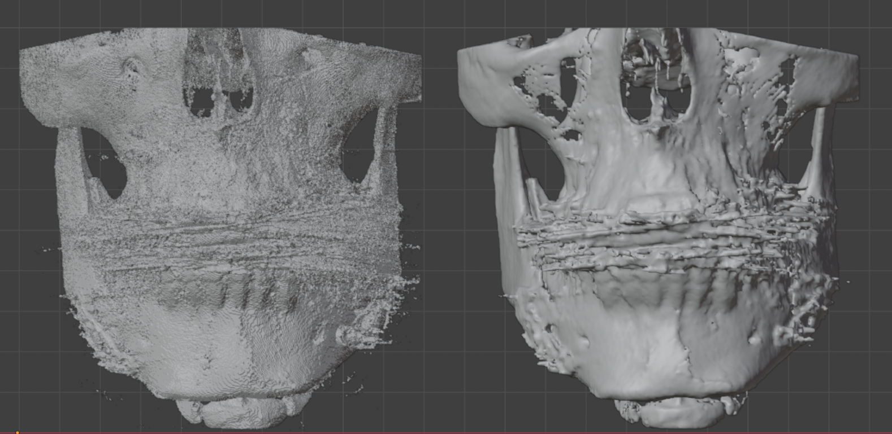
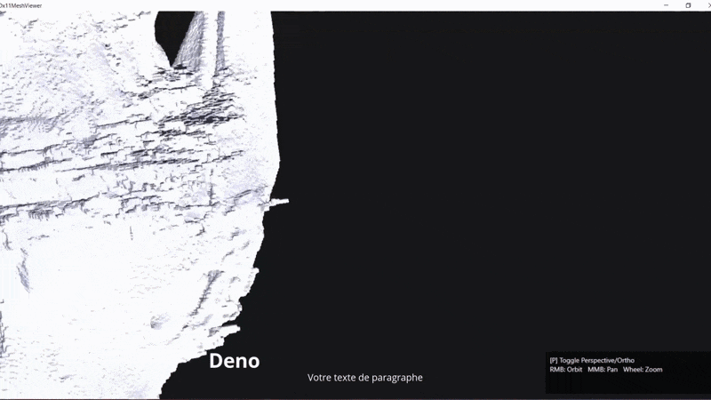

# dx11DicomViewer

Ce projet permet la reconstruction 3D à partir de séries d’images DICOM (scanner pour notre cas), l’extraction de maillages surfaciques et la visualisation interactive des volumes médicaux.

__**NB:**__  Le projet a été effectué dans le cadre d'un stage de fin d'études, j'ai créé une autre version [ici](https://github.com/NomenaFitia/QtDicomViewer) en utilisant __**C++**__ ,__**Qt**__, __**OpenGL**__ .

---
### Fonctionnalités

- Charger et parser des fichiers DICOM
- Segmentation ( Hounsfield unit )
- Extraction de surface ( Marching cubes )
- Simplification de maillage ( décimation et lissage )
- Visualisation interactive ( DirectX11 )
- Export OBJ

---

### Captures d'écrans

Comparaison de surface brute et surface décimée



Visualisation en temps réel avec DirectX11



---
## Build
### Pour une session
```
$env:VCPKG_ROOT = "C:\vcpkg"

Set-ExecutionPolicy -Scope Process -ExecutionPolicy Bypass
```
### Avec vcpkg explicite
```
./build.ps1 -Config Debug -Triplet x64-windows -VcpkgRoot "C:\vcpkg"
```

### ou en utilisant VCPKG_ROOT de la session
```
$env:VCPKG_ROOT = "C:\vcpkg"
./build.ps1 -Config Debug -Triplet x64-windows
```
---

## Architecture du projet

```
DX11DICOMVIEWER
    external
        tinyobjloader
    shaders
    src
        app
        core
        io
        platform
        render
        scene
        utils
        main.cpp
    CMakeLists.txt
    Readme.md
    vcpkg.json
```
---

## Stack technique

- Langage : C++, HLSL
- Librairies principales : fmt, dcmtk, directxmath, tinyobjloader

---


